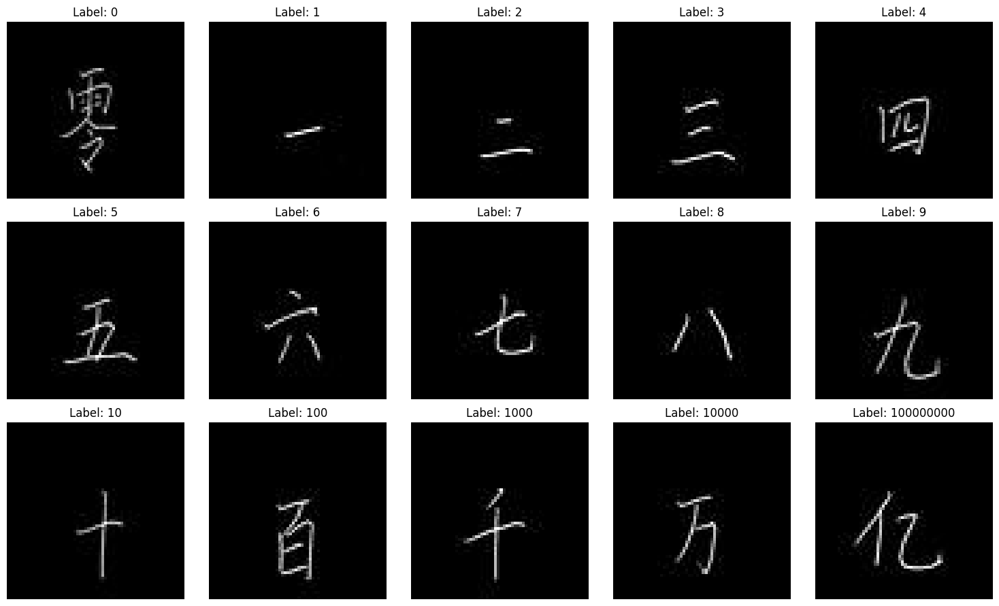
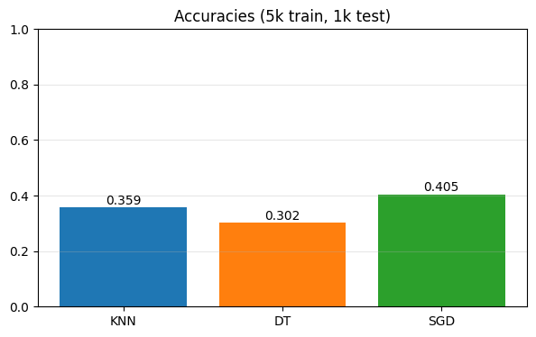
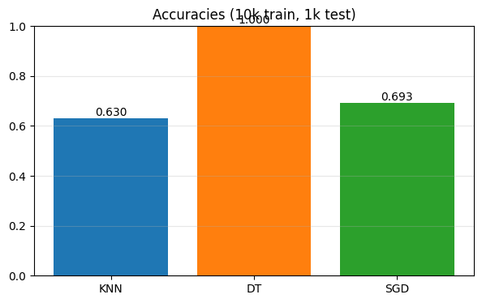
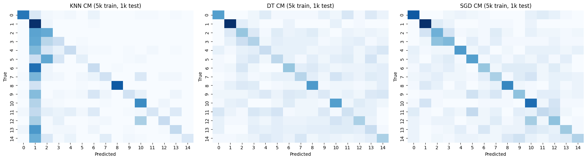
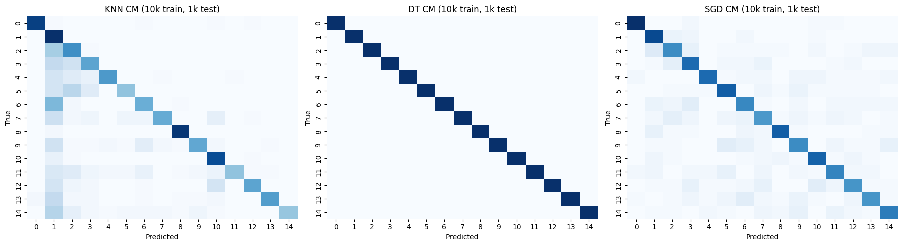

# Chinese Handwriting Classification (Computer Vision)

Classifies handwritten Chinese numerals from the Chinese MNIST dataset using classical ML classifiers on flattened pixel data.

## Overview

Chinese MNIST contains 15,000 images of handwritten Chinese numerals (零 to 十五) from 100 writers. This project loads the images, flattens them into pixel vectors, and compares three classifiers (KNN, Decision Tree, SGD) at two training-set sizes.

## Results

Sample characters loaded from the dataset:



Classifier accuracy at 5k and 10k training samples (1k held-out test set, stratified across all 15 classes):




Confusion matrices:




Measured accuracy from the notebook (`sklearn.metrics.accuracy_score`, 990-sample test set):

| Classifier | 5k train | 10k train |
|---|---|---|
| KNN (k=3) | 0.3586 | 0.6303 |
| Decision Tree | 0.3020 | 1.0000 |
| SGD (max_iter=250) | 0.4051 | 0.6929 |

Note: the Decision Tree's 1.0000 accuracy at 10k train is the number the notebook actually produced, but a perfect score is an outlier next to the other two classifiers and worth double-checking for train/test overlap before treating it as a real result.

## Tech Stack

- **Language:** Python 3
- **Libraries:** OpenCV, pandas, NumPy, matplotlib, seaborn, scikit-learn
- **Environment:** Jupyter Notebook

## Key Concepts

- Loading a Chinese MNIST metadata CSV (`suite_id`, `sample_id`, `code`, `value`, `character`) and joining it against per-sample image files
- Flattening 64×64 grayscale images into 4096-d vectors
- Stratified train/test sampling (5k and 10k train, 1k test, ~equal samples per class)
- Classical multi-class classification: K-nearest neighbours, Decision Tree, SGD
- Confusion matrix and per-class precision/recall/F1 (`classification_report`)

## Project Structure

```
cv-chinese-handwriting-classification/
├── chinese_handwriting_classification.ipynb    # Data loading, classification, evaluation
├── chinese_mnist.csv                            # Committed but empty (all-zero bytes) — not the dataset used by the notebook
└── images/                                       # Result images extracted from notebook outputs
    ├── sample_characters.png
    ├── accuracy_5k.png
    ├── accuracy_10k.png
    ├── confusion_matrices_5k.png
    └── confusion_matrices_10k.png
```

Important: the notebook actually reads `Chinese_MINST_Dataset/chinese_mnist.csv` and per-sample images from `Chinese_MINST_Dataset/data/data/input_<suite_id>_<sample_id>_<code>.jpg` — a folder that is **not** present in this repository. The `chinese_mnist.csv` file at the repo root is a separate, unused, empty placeholder (0 non-zero bytes). To run the notebook, download the [Chinese MNIST dataset](https://www.kaggle.com/datasets/gpreda/chinese-mnist) and place it under `Chinese_MINST_Dataset/` with that same layout.

## Dataset

- **Source:** Chinese MNIST (Kaggle: https://www.kaggle.com/datasets/gpreda/chinese-mnist)
- **Images:** 15,000 × 64×64 grayscale
- **Classes:** 15 Chinese numerals (零、一、二、...、十五)
- **Writers:** 100 individuals (150 samples each)

`chinese_mnist.csv` is included in this repository as-is. Credit for the data belongs to the source above; see it for the original license and citation terms.

**This repo is not fully self-contained.** `chinese_mnist.csv` holds only the `suite_id`/`sample_id`/`code`/`value`/`character` label metadata (one row per sample) — it does not contain pixel data. The actual 15,000 handwritten-character images (64×64 grayscale JPEGs, named `input_<suite_id>_<sample_id>_<code>.jpg`) are a separate image directory that ships alongside `chinese_mnist.csv` in the original Kaggle dataset and is **not** included here. To run the notebook end-to-end you must download the full dataset from the source above and place the image folder locally (matching the path the notebook expects) — the CSV alone is not enough to reproduce the pixel-loading steps.

## How to Run

```bash
pip install opencv-python pandas numpy matplotlib seaborn scikit-learn jupyter
jupyter notebook chinese_handwriting_classification.ipynb
```

Developed and tested with Python 3.9+ and Jupyter Notebook / JupyterLab.
